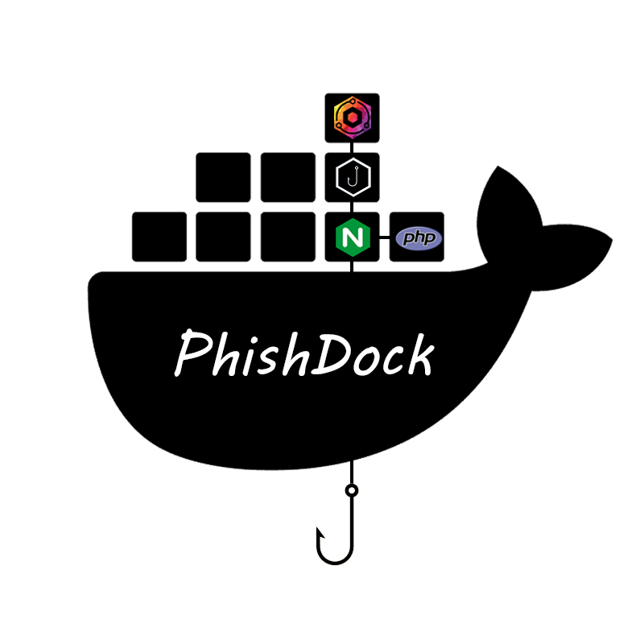

<p align="center">
  
</p>

Automated Docker infrastructure with Gophish, Nginx Proxy Manager, Nginx and PHP

## Usage

Just spawn up the PhishDock infrastructure via:

````
git clone https://github.com/l4rm4nd/PhishDock
cd PhishDock
docker compose up
````

This will spawn up the following containers:

- Nginx Proxy Manager
  -  Used as SSL reverse proxy. Supports a management UI, Let's Encrypt, automated SSL certificate renewals and various APIs of popular DNS providers.
- Gophish
  - Used as phishing framework. Supports a management UI to create phishing campaigns, landing pages, site cloning etc.
- Nginx
  - Optional web server to provide awareness sites, redirect sites or custom web pages.
- PHP
  - PHP support for the optional nginx web server

**Note**: Nginx Proxy Manager is pre-configured and already defines three proxy hosts:
- `gophish.phishdock.com` is a proxy host for the Gophish admin backend UI. It uses an access list and is only accessible from local LAN IP ranges.
- `landing.phishdock.com` is a proxy host for Gophish landing pages provided by the Gophish docker container on TCP/80. 
- `awareness.phishdock.com` is a proxy host for the nginx docker container. It serves the purpose of being able to create custom awareness pages to redirect on. For example after a victim submitted data on a Gophish landing page. The victim may then be redirected to this nginx docker container via NPM reverse proxy.

SSL/TLS was not configured on purpose within the NPM container. All configured proxy host domains are imaginary and an example, please adjust. Gophish was not configured at all. Please adjust to your needs and setup. Do not forget to configure SSL/TLS as well as DNS (A-records, MX-records, PTR-record, SPF, DKIM, DMARC). Test your setup with an exemplary Gophish domain!

## Default credentials

### Nginx Proxy Manager

The Nginx Proxy Manager instance will be available at http://127.0.0.1:81.

The default login credentials are:

````
example@phishdock.com:PhishDock!
````

**Note**: You may change this default password at first login.

### Gophish

The Gophish instance will be available at http://127.0.0.1:3333.

The default login credentials are:

````
admin:PhishDock!
````

**Note**: You must change this default password at first login.
